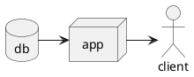

> This post will cover PlantUML basics and how it can be used in GitLab or GitHub projects as well as a seamless local development environment using Visual Studio Code.

<!-- TOC -->

- [PlantUML Basics 👨‍🎨](#plantuml-basics-‍)
  - [Reasons to love PlantUML 🤗](#reasons-to-love-plantuml-)
    - [Versioning](#versioning)
    - [Syntax](#syntax)
    - [Layouting](#layouting)
- [Local development](#local-development)
  - [Visual Studio Code](#visual-studio-code)
  - [Render to SVG/PDF](#render-to-svgpdf)
- [GitLab integration](#gitlab-integration)
- [GitHub integration](#github-integration)

<!-- /TOC -->

I have been wanting to write this post for months. Lately I have been using PlantUML extensively at work but also in my private projects. You can see it being used in my [plantbuddy](https://github.com/anoff/plantbuddy#main-features) and [techradar](https://github.com/anoff/techradar#design) projects on GitHub. Using it in various places and for changing purposes I came across a bunch of issues that I want to share in this post.

# PlantUML Basics 👨‍🎨

For those that do not know [PlatUML](http://plantuml.com/) it is an open source tool that allows you to define UML diagrams with plain text. There are different [diagram types](http://plantuml.com/sitemap-language-specification) available being described with custom syntax but following a common scheme. This post will not go into the details of each of those diagram types because the PlantUML website does a pretty good job at describing [sequence](http://plantuml.com/sequence-diagram), [component](http://plantuml.com/component-diagram), [activity](http://plantuml.com/activity-diagram-beta) and the other diagram types.

A basic component diagram showing data flow can be built using the following markup:

## Reasons to love PlantUML 🤗

### Versioning

A very important aspect for developing software and writing documentation is to keep it in sync. One aspect is that you have to update your documentation if you update the code itself. Another important aspect is versioning - typically software is versioned using `git` or similar systems. By putting your documentation into the same repository as the code you also make sure you always look at the correct state of documentation for a respective point in time.

For that reason I love putting all my documentation either within the sourcecode as comments or as Markdown files next to the sourcecode. One thing I was always lacking with this approach is visualizing things. Putting PowerPoint/Keynote/Visio/Enterprise Architect.. files into a repository does make sure your diagrams are always versioned with the code - but they are not browsable in Web UIs. Come PlantUML and GitLab rendering to the rescue: GitLab allows you to [inline PlantUML diagrams](https://gitlab.com/gitlab-org/gitlab-ce/blob/master/doc/administration/integration/plantuml.md) directly into your Markdown files and they will be rendered on the fly when viewing the files in the browser.

One other benefit PlantUML has over the mentioned tools is that by defining your diagrams in plain text you make them diff-able in pull requests. Reviewers can always see what changes have been made and easily compare changes to the diagram with changes made inside the code.

### Syntax

The basic syntax of PlantUML is very concise and builds a good foundation for the different diagram types. It is also well very smart in the way that it allows diagrams to be written with different flavors e.g. it allows you to declare nodes at the top, but if you do not declare them they will be inferred when used. Same goes for [macros and definitions](http://plantuml.com/preprocessing) that allow you to compose larger diagrams or a common library for your team.

### Layouting

Compared with WYSIWYG editors PlantUML diagrams only define components and their relationship but not the actual layout of the diagram. Instead the diagram is inferred by a deterministic algorithm in the rendering process. This has the advantage that when specifying the diagram you only focus on the content - comparable to when you write down a LaTeX document.
Sadly the layouting engine is not as good as you sometimes wish it to be and especially in component diagrams with 5 nodes and more you might end up spending a lot of time enforcing specific layouts manually.

For sequence and activity diagrams the automatic layouting works great even for very large diagrams. If you built a few diagrams and notice how easy it is to just move lines of code up and down and end up to reflect changes in the code you will love the automatic layouting.

# Local development

## Visual Studio Code

## Render to SVG/PDF

# GitLab integration

# GitHub integration

- plantUML
- why i love it
  - syntax
  - layouting mehhhh components
  - layouting yaaay sequence
- rendering/versioning, URL=content
- vscode (extension, docker)
- set up with github - includeurl -> stlye?
- gitlab
- render svg
  - icons http://plantuml.com/stdlib
- docker

http://plantuml.com/deployment-diagram

http://plantuml.com/skinparam

http://plantuml.com/preprocessing

https://stackoverflow.com/questions/32203610/how-to-integrate-uml-diagrams-into-gitlab-or-github

http://forum.plantuml.net/7163/githubs-aggressive-caching-prevent-diagrams-updated-markdown