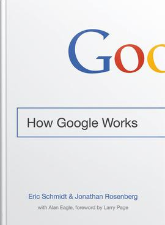

<head>
<link rel="stylesheet" href="../../css/mine.css" />
</head>

`TODO: FIX LINK`

As [promised](../2019-01-15-book-2018-in-books.md) (`TODO: FIX LINK`) my book series will start with two books out of the [FANG](https://en.wikipedia.org/wiki/Facebook,_Apple,_Amazon,_Netflix_and_Google) league. The book _How Google works_ covers many aspects of the companies culture. The book has lots of management insights - that at the time of reading - were of little interest to me. Therefore I want to briefly highlight a few points about [innovation](#innovation) that I find fascinating and then move to the human factors like [recruiting](#recruiting) and [competence management](#competence-management) that are also covered extensively in the book.

## Innovation

`TODO: FIX LINK`
> Photo by Sharon Pittaway on Unsplash

The book makes some clear statements about innovation really means for Google and might help you differentiate between bullshit bingo and real innovation:

1. Giving customers what they want is **not innovative**
    - Relates to the Henry Ford ([or not](https://hbr.org/2011/08/henry-ford-never-said-the-fast)) quote `“If I had asked people what they wanted, they would have said faster horses.”`
    - Instead surprise customers and provide something fundamentally useful they did not have before
1. Multiple small non-innovative steps combined can lead to innovative products
    - One example given here is Google Mail that was not an innovation per se but the combination of cloud storage, web applications, artificial intelligence created a product that entered an existing market and disrupted it
1. Innovators do not need to be told that they should be innovative
    - Innovation is not learned it is a personality trait
    - You can foster innovation but you can not learn or _command_ it
    - To achieve true innovation give innovators freedom to operate (time, resources, trust)
1. Large corporations attract **risk-avoiding employees** that often tend to hinder innovation
    - Employees that seek a safe place hardly embrace change and even less actively bring it into an organization

## Management

`TODO: FIX LINK`

> Photo by rawpixel on Unsplash

As mentioned before there are a lot of management aspects covered in this book that did not make it into my personal notes. I might have to read those up again at some point. One deduction that stuck with me is about processes in an innovative environment:

1. `"If everything seems under control, you're just not going fast enough."` ([Mario Andretti](https://en.wikipedia.org/wiki/Mario_Andretti), Race car driver)
    - In this context: If you do not experience any problems you are not innovation as fast as you could
1. **Processes are slower than reality**
    - YES, YES, YES
1. Chaos is the normal not an exception
    - In an innovative environment what you consider realistic might change any day
1. Order and processes can not be enforced
    - Even in innovative environments you need to establish some _rules_
    - These rules need to be decided and implemented by everyone involved from top management to worker
    - To have this open discussion and decision making you need to have a culture of **openness, transparency, meritocracy and honesty**

## Recruiting

`TODO: FIX LINK`
> Photo by Ryoji Iwata on Unsplash

A term that keeps reappearing in the book is **the smart creative** that is describes a person that belongs to the

> "[..] the ambitious ones **of all ages** who are eager (and able) to use the tools of technology to do a lot more. Their common characteristic is that they work hard and are **willing to question the status quo** and attack things differently. This is why they can have such an impact.
It is also why they are uniquely difficult to manage, especially under old school models, because no matter how hard you try, you **can’t tell people like that how to think**. If you can’t tell someone how to think, then you have to learn to manage the environment where they think and to make it a place where they want to come every day."

This definition resonates so well with me because after reading it I realized that all the people I look up to within my personal network are not willing to accept the status quo and keep asking _Why do we need to do it this way?_. I fought many battles myself, often I was close to giving up but in the end being persistent in your will to change something you will most likely succeed. Too often things are done in ways that are based on assumptions that are no longer valid or might not be applicable for you. Keep in mind to **stay constructive** when going up against established rules though - try to understand their reasoning and explain why you think it may not apply to your cause. Playing naive also helps 😉

The main points that the book makes about hiring such smart creatives is to:

1. Hire people that are life long learners
    - People you do not have to train for the new upcoming technology but those that want to bring it in and learn it out of curiosity
    - One point I take away from this is to read CVs more carefully regarding things like off-work trainings, pet projects etc.
1. Generalists over experts
    - The reasoning is that IT changes so quickly it is likely the field you are an expert in now may no longer be relevant to the industry, your product or your company in the future. It is more important to excel at learning new concepts than to already master them.
1. Hiring (only) people you want to have as friends makes a bad team
    - This aspect might be controversial but given the reasoning I think it makes sense - and is _too often_ ignored
    - People you like _as friends_ share your interests and your views on things
    - This results in little diversity in opinions and paths of reasoning
    - Without diversity you will never have _all possible options_ on the table when you need to make a decision
    - This might lead to a sub-optimal decision because the best solution was not considered
    - It matters more that you are able to have an interesting (objective) discussion with someone than to like them (LAX rule)
1. Hiring is every employees responsibility
    - To get the best you need to cast a wide net
    - Every employee should be looking for new talent
    - Make it part of your yearly employee reviews and bonuses for everyone, not just HR
1. Always hire _the best_ 
    - Train your employees to hire people they look up to
    - Once you start hiring someone you consider _only good_ and they themselves start hiring the collective skill will spiral downwards
    - **Never** settle for good

- bad point: creative people want open office spaces? WTF
- very exaggerated view on _classic_ companies

## competence management

- dynamic self, get feedback and evolve
- always keep learning, enable your employees to learn, select those that want to learn
- someone willing to learn is more valuable than a specialist
  - generalist > specialist, specialist may always be biased in decision making
  - IT changes fast -> no one is a specialist for long -> keep learning
- snippets: weekly _diaries_ max 1 page by every person published into the intranet w/o further presentation
