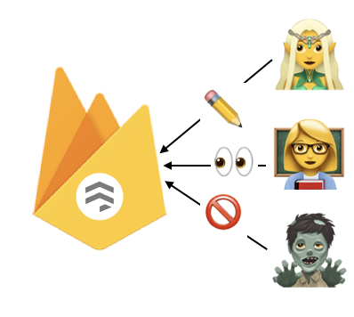

This post will explain how to implement role based access control ([RBAC](https://en.wikipedia.org/wiki/Role-based_access_control)) using the Google Firestore serverless database.

## Firestore basics

Firestore is database that is part of Googles Firebase suite for mobile app development. It is currently in _beta_ and has the potential to replace the current Firebase Realtime Database due to its superior API and features.
> [Cloud Firestore](https://firebase.google.com/docs/firestore/) is a flexible, scalable database for mobile, web, and server development from Firebase and Google Cloud Platform

For those that never used a Firebase database; it is a NoSQL document oriented database. Firestore allows you to nest documents by creating multiple collections inside a document.


The Firebase suite is built for mobile development and provides SDKs for all major languages. JavaScript/Node.js, Swift, Objective C, Android, Java, Python, Ruby, Go. The SDKs allow add, query or delete data as well as other operations required when interacting with a database as a client. One feature I really like is the possiblity to register your client to receive [updates](https://firebase.google.com/docs/firestore/query-data/listen) automatically. This allows you to build **three way data binding** in realtime applications easily. This is a feature I used in my [first project with Firebase](https://github.com/anoff/microllaborators).

In combination with the Firebase [authentication provider](https://firebase.google.com/docs/auth/) you can limit access the database to people that are logged in. The auth provider also provides an SDK and requires only a few lines of code to implement in a web app.

```plantuml
@startuml
!include <font-awesome/common>
!include <devicons/firebase>
!includeurl https://gist.githubusercontent.com/anoff/c531251183cf9590b0f86ac85d5bc353/raw/fancy.plantuml
skinparam defaultTextAlignment center

node "Web App\n(Browser)" as app
actor "User" as user

DEV_FIREBASE(db, database, database)
DEV_FIREBASE(auth, auth provider, component)

user ->> app
app ->> db
app -down->> auth
@enduml
```

## Firestore Security Rules

The ability to create a detailed rule set make Firestore enable use cases for a serverless database without any backend code and still keeping data secure. It is also the foundation for building a role based access control.

> All roles and authorization rules will be enforced by the Firestore server

Security rules are written in a JavaScript-like syntax but have their own methods. First you nest `match` operators to specify the document level you want to be affected by this rule. Use `{wildcards}` that can later on be referenced in the rule definition. Granting/denying access is done via an `allow <method> if` statement that grants access if it returns `true` or otherwise blocks the transaction.

```javascript
service cloud.firestore {
  match /databases/{database}/documents {
    allow read, write: if <some_condition>;
    allow delete: if false;
  }
}
```

There are **five methods** that can be specified:

1. `get`: retrieve a single document
1. `list`: read an entire collection or perform queries
1. `create`: write to non existing documents
1. `update`: write to existing documents
1. `delete`: remove a document


The modifying operations 3-5 can be addressed using the `write` method instead of specifying them individually, `read` applies both _get_ and _list_. If multiple rules match for a request only one needs to resolve to `true` for the request to be successful.

```javascript
// allow anyone to read but only signed in users to create/update; only a specific user can delete
service cloud.firestore {
  match /databases/{database}/documents {
    match /posts/{document=**} {
      allow read: if true;
      allow create, update: if request.auth != null;
      allow delete: if request.auth.uid == 'an0xff';
    }
  }
}
```

## Creating role based security roles

We will create a RBAC for a simple content site with _posts_ that can be commented with the following roles:

- **writer**: can create new posts, delete moderate (delete) comments, can modify its own posts
- **editor**: can edit any post post (text body only), delete comments
- **user**: can create and modify its own comments


