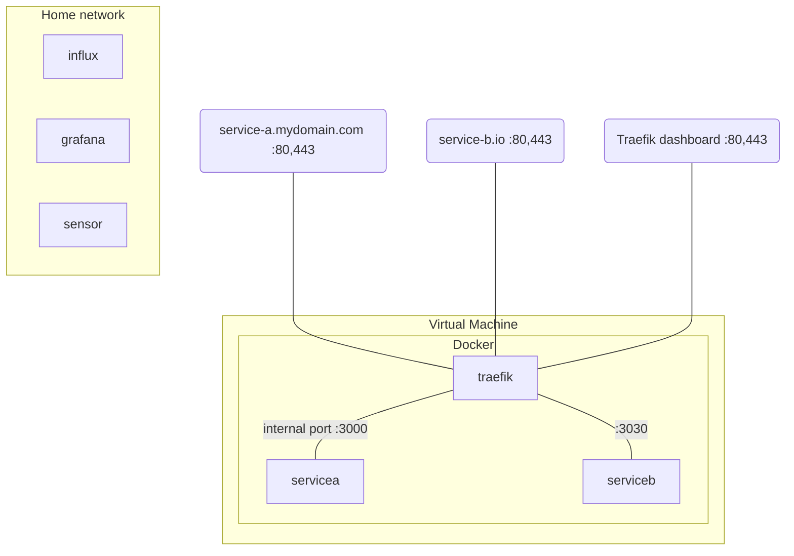
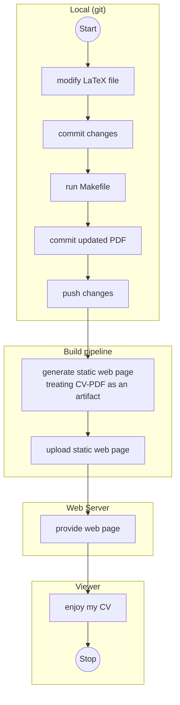

**Network Setup**

```mermaid
graph TD
  SSLa("service-a.mydomain.com :80,443")
  SSLb("service-b.io :80,443")
  SSL_traefik("Traefik dashboard :80,443")
  
  subgraph home["Home network"]
    influx
    grafana
    sensor
  end
  
  subgraph VM1["Virtual Machine"]
    subgraph docker1["Docker"]
       servicea
       serviceb
       traefik
    end
    traefik -- "internal port :3000" --- servicea
    traefik -- ":3030" --- serviceb
  end

  SSLa --- traefik
  SSLb --- traefik
  SSL_traefik --- traefik
```

**Container Setup on Raspberry**

```mermaid
flowchart TD
    subgraph Local["Local (git)"]
        start((Start)) --> mod[modify LaTeX file]
        mod --> commit[commit changes]
        commit --> run[run Makefile]
        run --> commitPDF[commit updated PDF]
        commitPDF --> push[push changes]
    end
    
    subgraph Build[Build pipeline]
        push --> gen["generate static web page\ntreating CV-PDF as an artifact"]
        gen --> up[upload static web page]
    end
    
    subgraph Web[Web Server]
        up --> prov[provide web page]
    end
    
    subgraph Viewer[Viewer]
        prov --> enjoy[enjoy my CV]
        enjoy --> stop((Stop))
    end
```
