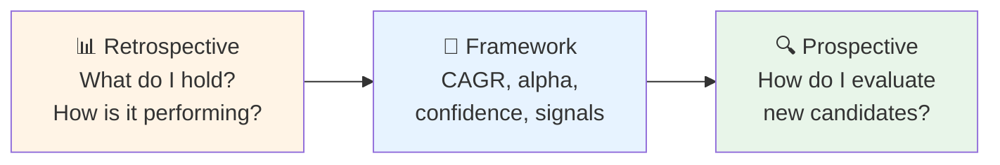
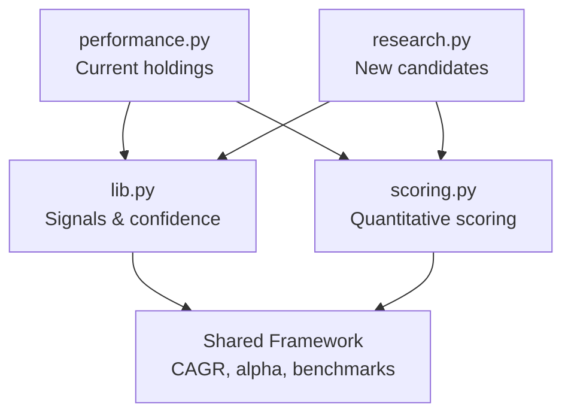

My stock portfolio is spread across multiple brokers in different countries — Japanese stocks with one broker, European positions with another, investment funds in a third account.
Each has its own dashboard, export format, and way of presenting performance.
Relying on these dashboards as my single source of truth felt uncomfortable.
What if a broker changes its interface or suspends my account?
How do I compare positions across currencies, time horizons, and purchase dates?

I wanted **local, inspectable, portable data ownership** — files on my own disk that don't disappear if a broker changes policy.
Not just the raw transaction records, but the **analysis process itself**.

This post tells the story of how I built a suite of tools to solve that problem.
But the real journey wasn't about writing Python scripts — it was about discovering **how to think about stock performance** in the first place.
This was also a trial run in using AI end-to-end: **Gemini** for strategic thinking and high-level concepts, **Claude** and **VS Code Copilot** for implementation and debugging.

<!--more-->

<!-- TOC depthFrom:2 -->

- [I Did Not Know How To Analyze Stocks](#i-did-not-know-how-to-analyze-stocks)
- [AI as a Thinking Partner](#ai-as-a-thinking-partner)
- [Performance Tool: `performance.py`](#performance-tool-performancepy)
  - [The Fuzzy Signal System](#the-fuzzy-signal-system)
- [From Retrospective to Prospective: The Conceptual Shift](#from-retrospective-to-prospective-the-conceptual-shift)
- [Research Tool: `research.py`](#research-tool-researchpy)
  - [Expanded Metrics: Five-Category Scoring](#expanded-metrics-five-category-scoring)
- [Shared Architecture](#shared-architecture)
- [The Complete Framework](#the-complete-framework)

<!-- /TOC -->

## I Did Not Know How To Analyze Stocks

Having CSV files locally was necessary, but not sufficient.
The harder problem was that **I had no idea what "fair comparison" even meant across different holdings**.

Raw percentage return is misleading when purchase dates differ.
One stock I bought two months ago: +15% return.
Another held for three years: +25% return.
Which is actually performing better on a **velocity** basis?

Position size complicated intuition further.
A large position with small upside felt emotionally safer than a small position with explosive growth, even though that's irrational.
My judgment was distorted by exposure size, not performance quality.

**The problem:** How can I compare unlike positions on equal footing, independent of holding period and position size?

This wasn't a coding problem — it was an analytical problem.
I didn't know what metrics to calculate.

## AI as a Thinking Partner

I used AI — primarily **Gemini** for strategic discussions — not to "tell me what metrics to use," but to help me reason through why raw returns weren't comparable.

> **Me:** I have two stocks. One is up 15% in 2 months, the other is up 25% in 3 years. How do I know which is performing better?
>
> **AI:** You're comparing absolute returns over different time periods. To normalize for holding duration, you need to annualize the returns. The standard metric is CAGR — Compound Annual Growth Rate.
>
> **Me:** So CAGR adjusts for time. But what if both stocks are just riding a bull market?
>
> **AI:** That's where **alpha** comes in. Alpha is your return minus a benchmark return over the same period. If you hold Japanese stocks, compare against TOPIX. If you hold US stocks, compare against the S&P 500.

Two key insights emerged:

**CAGR** (Compound Annual Growth Rate) normalizes for time.
A stock held 6 months with +20% return = CAGR of ~44%.
A stock held 2 years with +40% return = CAGR of ~18%.
The shorter-held position is compounding faster.

**Alpha CAGR** = stock CAGR minus benchmark CAGR.
A stock returning +15% annualized sounds good until you realize the S&P 500 returned +20% over the same period.
Your alpha is -5% — you're underperforming despite absolute gains.

Once I had the conceptual framework from Gemini, I switched to **Claude** and **VS Code Copilot** for implementation — writing functions, debugging edge cases, refining the signal logic.


## Performance Tool: `performance.py`

**Purpose:** "How are my current holdings performing?"

The script imports broker CSVs (Japanese Shift-JIS encoded, European German-formatted), normalizes them into a unified structure, fetches live prices via `yfinance`, then calculates:

- **CAGR**: Time-normalized returns
- **Alpha CAGR**: Benchmark-relative performance
- **Confidence dampening**: Positions under 3 months get low confidence, ramping to 100% at 8+ months
- **Short-term signals**: 1-month (pulse) and 6-month (trend) returns

Rather than binary buy/sell commands, it produces a **fuzzy signal** from a composite score.

### The Fuzzy Signal System

The core insight: **investment decisions aren't binary**. A position might have strong fundamentals but weak momentum, or vice versa. Rather than forcing a hard buy/sell choice, the script combines multiple dimensions into a contextual recommendation.

The composite score formula:

```
Score = (0.45 × alpha_CAGR_score + 0.35 × CAGR_score + 0.20 × 6M_score) × confidence
```

**Weight rationale:**
- **45% alpha** — Benchmark-relative performance is the strongest signal. Absolute returns mean less if the market delivered the same.
- **35% CAGR** — Long-term compounding velocity matters, even if alpha is neutral.
- **20% short-term trend** — Recent 6-month momentum captures turning points.
- **Confidence dampening** — Positions held < 3 months get multiplied by a low confidence factor (e.g., 0.3), ramping linearly to 1.0 at 8+ months. This prevents noise from new positions dominating the analysis.

Each metric (alpha, CAGR, 6M return) is normalized to a 0–100 scale based on empirically observed thresholds:
- Alpha > +10%/year → score 100 (exceptional outperformance)
- Alpha near 0% → score 50 (tracking benchmark)
- Alpha < -10%/year → score 0 (significant underperformance)

The final composite score (0–100) maps to **contextual signals**:

| Score Range | Signal | Meaning |
|-------------|--------|----------|
| 75–100 | 🟢 **Hold** | Solid performer, no action needed |
| 60–74 (high CAGR, fading momentum) | 🟣 **Take Profit** | Strong CAGR (>25%) but 6M momentum weakening — consider realizing gains |
| 60–74 (fundamentals ok, recent dip) | 🔵 **Buy More** | Good long-term metrics but recent pullback — potential averaging opportunity |
| 40–59 | 🟡 **Watch** | Mixed signals, monitor closely |
| 0–39 | 🔴 **Sell** | Sustained underperformance, consider cutting losses |
| (any, if held < 3 months) | ⏳ **Too Early** | Not enough data to judge |

This isn't algorithmic trading — it's **decision support**. The script doesn't execute trades; it surfaces patterns I might miss when looking at percentages in isolation.

Output: timestamped Markdown reports + PNG charts (CAGR bars, returns heatmap, alpha scatter).

## From Retrospective to Prospective: The Conceptual Shift

Once the portfolio reporting framework became trustworthy, something shifted.

I stopped thinking of it as purely retrospective.
The same analytical lens — CAGR, alpha, benchmark-relative thinking — could apply to **evaluating new opportunities**.

The question changed from **"How are my holdings doing?"** to **"How should I evaluate possible next positions using the same vocabulary?"**

This is the point where the tool suite moved from **tracking** to **decision support**.

It wasn't a separate idea.
It was an extension of the same mental model the performance tool had established.
The portfolio tool proved the framework worked for held positions.
The research tool would apply it to candidates.

**Key insight:** If I trust CAGR and alpha to evaluate what I already own, why not use the same metrics to evaluate what I'm considering buying?

The research tool answers: **"How do I evaluate new candidates using the same benchmark-relative, normalized thinking?"**

Where the performance tool says "🔵 Buy More" (for a held position with a recent dip), the research tool says "BUY" (for a new candidate meeting the same criteria).

Same philosophy. Different entry point.



## Research Tool: `research.py`

**Purpose:** "How do new candidates compare?"

Once the portfolio framework proved reliable, I extended it to evaluate candidates before buying.
Same CAGR and alpha foundation, but adds **five-category fundamental scoring**.

### Expanded Metrics: Five-Category Scoring

Beyond price-based metrics (CAGR, alpha, momentum), the research tool adds **fundamental analysis** through a quantitative scoring engine:

**1. Valuation** — Are you overpaying?
- P/E ratio (price-to-earnings)
- P/B ratio (price-to-book)
- EV/EBITDA (enterprise value to earnings before interest, taxes, depreciation, amortization)

Scoring: Lower is better. A P/E of 10 scores higher than a P/E of 50. Normalized against ACWI top holdings bands.

**2. Quality** — Is the business efficient?
- ROE (return on equity) — how well the company uses shareholder capital
- Operating margin — operational efficiency
- Gross margin — pricing power and cost structure

Scoring: Higher is better. ROE > 20% scores near 100; ROE < 5% scores near 0.

**3. Health** — Is it financially stable?
- Debt-to-equity ratio — leverage risk
- Current ratio — short-term liquidity (current assets / current liabilities)
- Free cash flow — ability to fund operations and growth without external capital

Scoring: Lower debt, higher liquidity, positive FCF → higher scores.

**4. Growth** — Is it expanding?
- Earnings growth (YoY, quarterly trends)
- Revenue growth (top-line expansion)

Scoring: Sustained growth > 10%/year scores well; negative growth scores poorly.

**5. Momentum** — Is the market recognizing it?
- 1-month return (the "pulse")
- 6-month return (the "trend")
- Alpha trends (outperforming vs. benchmark)

Scoring: Same logic as the performance tool — recent positive momentum scores higher.

Each category is normalized **0–100 via benchmark bands** derived from MSCI ACWI (All Country World Index) top holdings.
This means a stock scoring 50 in Valuation is priced at the ACWI average; 100 means it's in the top percentile (cheap), 0 means expensive relative to the global index.

The five category scores are weighted and combined into a **final composite score** (0–100) that maps to a fuzzy signal:
- **STRONG_BUY** (score 80–100)
- **BUY** (score 65–79)
- **HOLD** (score 40–64)
- **SELL** (score 20–39)
- **STRONG_SELL** (score 0–19)

Visual output shows both the final signal and the per-category breakdown:

```
HOLD (🟢🟡🟢🔴🟢)
     └─ Valuation: Good (78/100)
        Quality: Neutral (52/100)
        Health: Good (81/100)
        Growth: Weak (25/100)
        Momentum: Good (72/100)
```

```bash
uv run research.py --tickers MSFT,AAPL,7011.T
```

Output goes to stdout (fast, composable). I pipe it to files or integrate with GitHub Actions for on-demand research reports.

## Shared Architecture

Both tools import from shared modules:
- `lib.py` — price helpers, fuzzy signal engine, confidence logic
- `scoring.py` — quantitative evaluation framework

Same thresholds, same dampening, same philosophy.
Different entry points (held vs. candidate), same vocabulary.



## The Complete Framework

This evolved into a **broker-agnostic, reproducible investing workflow**.

Starting point was fragmented data and unclear comparison methods.
Ending point is a tool suite that embodies a specific way of thinking:

- **Benchmark-relative** (alpha matters more than absolute return)
- **Time-normalized** (CAGR matters more than raw percentages)
- **Confidence-weighted** (skeptical of recency bias)
- **Multi-dimensional** (price + fundamentals)

Files are plain text: CSV inputs, Markdown outputs, PNG charts.
No proprietary lock-in. No cloud dependency. No SaaS subscription.

The AI collaboration wasn't about outsourcing thinking — it was about **turning vague discomfort into precise questions**, then building tools that reflect the answers.

**Gemini** helped me discover _what_ to build (CAGR, alpha, confidence framework).
**Claude** and **Copilot** helped me build _how_ (parsing, scoring, signals).

The tools don't make decisions. They surface information in a way that makes informed decisions easier.

If you're dealing with fragmented portfolio data or unclear performance comparison, maybe the **framework** (CAGR, alpha, confidence dampening) is more valuable than the specific scripts.

The code is in a private repo, feel free to reachout if you want a copy.
But the real takeaway isn't the implementation — it's the **mental model** it encodes.
